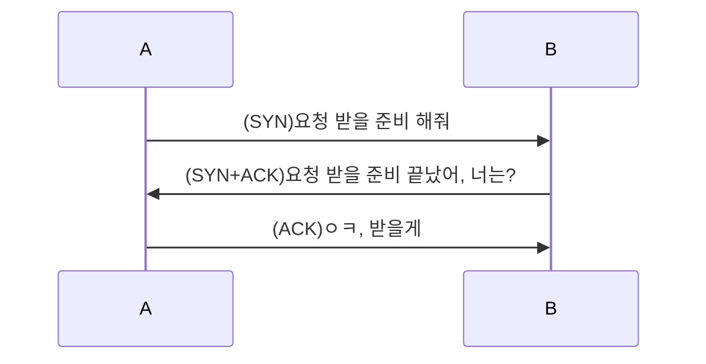
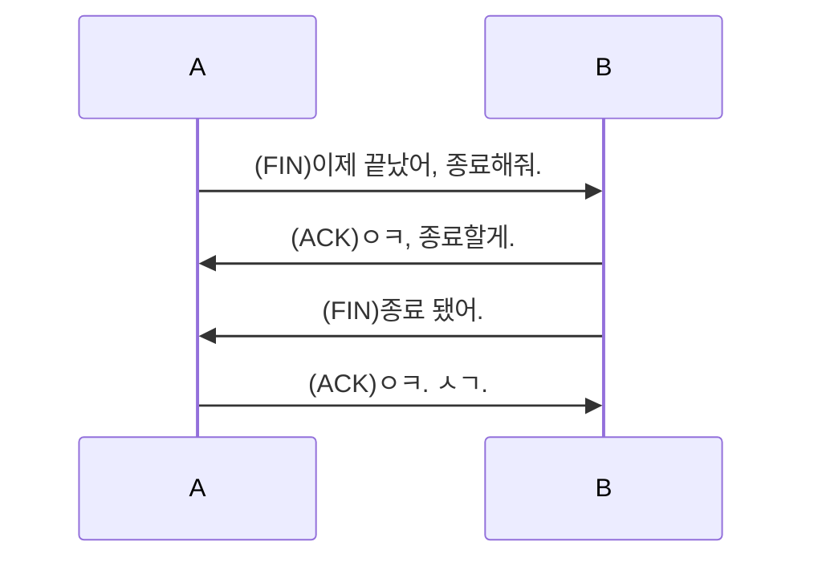

# OSI 7 계층

1. 물리 계층(Physical Layer) 전기적 신호
2. 데이터 링크 계층(DataLink Layer) MAC
3. 네트워크 계층(Network Layer) IP
4. 전송 계층(Transport Layer) TCP/UDP
5. 세션 계층(Session Layer) 연결유지
6. 표현 계층(Presentation Layer) 데이터를 표현 -> 파일
7. 응용 계층(Application Layer) 데이터 응용 프로그램-> HDD / 프로세스 -> RAM

# TCP/IP 4 계층

1. Network Interface
2. Internet
3. Transport
4. Application

# TCP/IP 5 계층

1. Physical
2. DataLink
3. Network
4. Transport
5. Application

# TCP | UDP 차이

## TCP

- 서로 간에 확인을 거치는 통신

### 3 HandShake

- 서로 간에 데이터를 받을 수 있게 연결한다.

### 4 HandShake

- 서로 간에 데이터 통신이 끝났으니 종료한다.

## UDP

- 데이터를 보내고 끝

## TCP VS UDP

- 속도: TCP < UDP
- 안정성: TCP > UDP
- 게임 만들 때: TCP < UDP, 빠르니까
  - 요즘엔: TCP > UDP

# HTTP 이론

- Header
  - Method
  - accept
  - Content-Type
  - Content-Length
  - ...
- Body
- 데이터 정보와 내용

## Method

- 요청의 종류

### GET

- 평소 우리가 쓰는 거.
- 정보를 받아오기 위해 사용

### POST

- 로그인 등등 정보를 보내기 위해 사용

### PUT

- 정보 전체를 수정 요청을 보내기 위해 사용

### PATCH

- 정보의 일부를 수정 요청을 보내기 위해 사용

### DELETE

- 정보를 삭제 요청을 보내기 위해 사용

### OPTION

- POST 등 정보 수정 등등을 요청 보낼 때 선요청으로 인증 절차 등을 진행하기 위해 사용

# REST API(RESTFUL API)

- Method를 적절히 사용하여 통신하는 방식
- HTTP 통신의 기초

## cookies

- 웹 서버가 생성하여 웹 브라우저로 전송하는 작은 정보 파일

# WSL / Ubuntu

## WSL

- Windows SubSystem Linux
  - Linux용 Windows 하위 시스템
- Hyper-V
  - 가상 머신 플랫폼
  - Virtual Machine
- WSL VS WSL2
  - Version: 1 VS 2
  - Base: WinAPI VS Kernel(VM)
- Windows에서 사용하다가 그대로 AWS 같은 클라우드에서 Ubuntu 등으로 사용하려면 WSL2
  가 좋음

## Ubuntu

- Linux의 커스텀 OS(오픈 소스)
- Linux: Kernel 기반의 오픈 소스 OS
  - Unix 계열의 OS
- Linux의 OS: centOS, redHet, Linux for AWS

# Gui

- 그래픽 사용자 인터페이스 ex) window

# Cli

-글자를 입력하여 컴퓨터에 명령을 내리는 방식 ex) Ubuntu(Linux)

# WinAPI

- MS에서 프로그래머보고 App만들때 쉽게 가져다 쓰라고 만들어 둔 소스코드

# Kernel

- 하드웨어와 응용 프로그램 사이에서 인터페이스를 제공하는 역할

# 방화벽

- 80 port(HTTP)를 방화벽에서 설정해주면 열어서 타인이 내 컴퓨터에 요청을 보낼 수 있다.
- 443 port(HTTPS)
- mySQL: 3306
